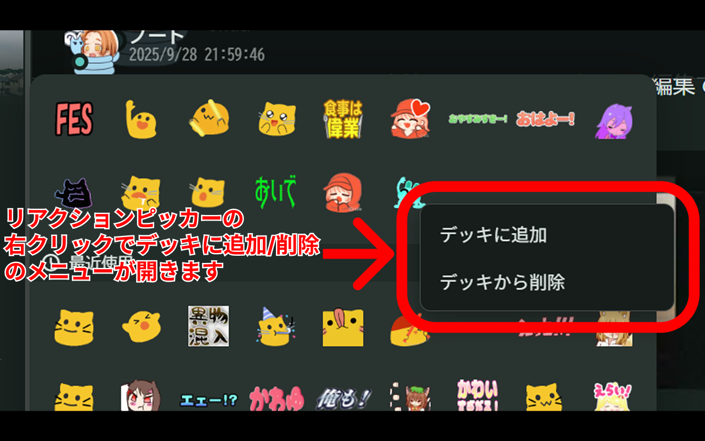

# Misskey Reaction Deck Helper

Misskey のリアクションピッカーからリアクションデッキを直接編集できるようにする Chrome 拡張です。

misskey.io のみをサポートしています。

## 仕組み
リアクションデッキの内容は、[misskey のレジストリ](https://misskey.io/registry/value/@/client/base/reactions)に保存されています。( `client/base` の `reactions` です)

本拡張機能は、レジストリにアクセスして、直接その内容を書き変えることでリアクションデッキを編集しています。

## 概要
- content script がピッカーの生成を監視し、絵文字セルに `contextmenu` リスナーを付与
- 右クリック時に独自のミニメニューを表示し、選択に応じてデッキを更新
- デッキ更新は以下の順で実行します
  1. ページと同オリジンの Misskey API（`/api/i/registry/get|set`）を呼び出す
  2. 失敗した場合のみ、ページ文脈に注入した `injected.js` に依頼し、`defaultStore.set('reactions', …)` を実行

## インストール (開発者)
1. Chrome の「拡張機能」ページを開く
2. 右上の「デベロッパーモード」を有効化
3. 「パッケージ化されていない拡張機能を読み込む」から本フォルダを選択（`manifest.json` が直下にあること）
4. Misskey のページをリロードし、絵文字ピッカーを開いて右クリックで動作確認

## 権限とセキュリティ
- content script として、対象ページの DOM と同オリジンの `localStorage`/`fetch` にのみアクセスします
- 取得したトークンはページ上の `localStorage.account` にあるものを Misskey 同オリジン API へ送信するためのみに使用し、外部へは送信しません

## プライバシー
- 個人情報や利用状況を収集・送信しません
- データは Misskey サーバとの通信のみに使用されます

## 利用規約
- 本拡張機能を使用したことで発生したいかなるトラブル・損失・損害に対しても、責任を負いません。心配ならコードをきちんと読んでくださいね。

## ライセンス
- MIT License（`LICENSE` を参照）
